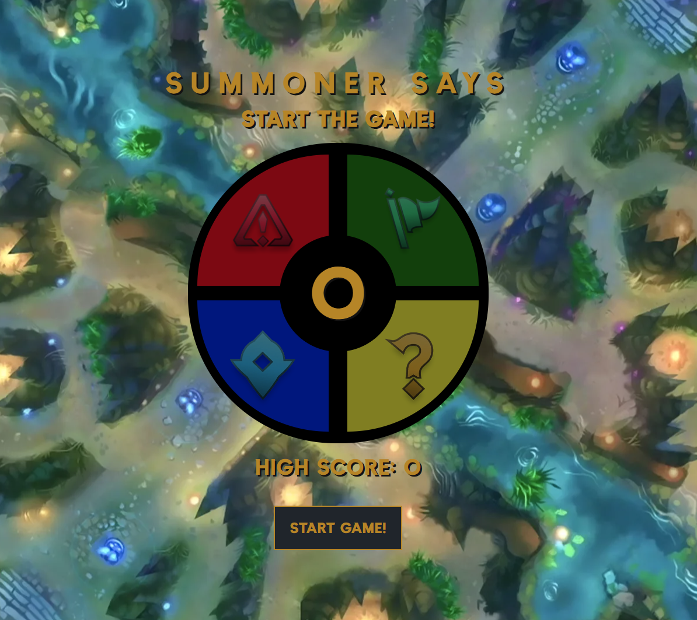
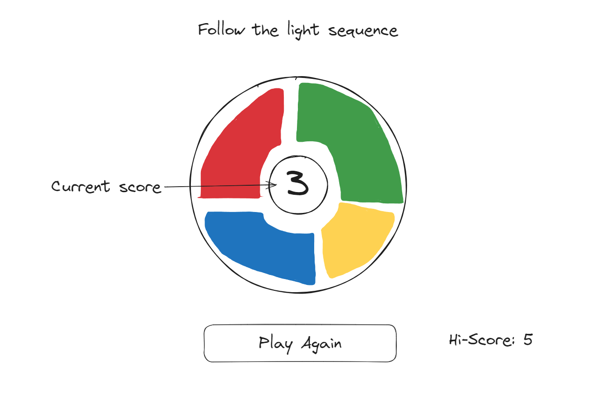
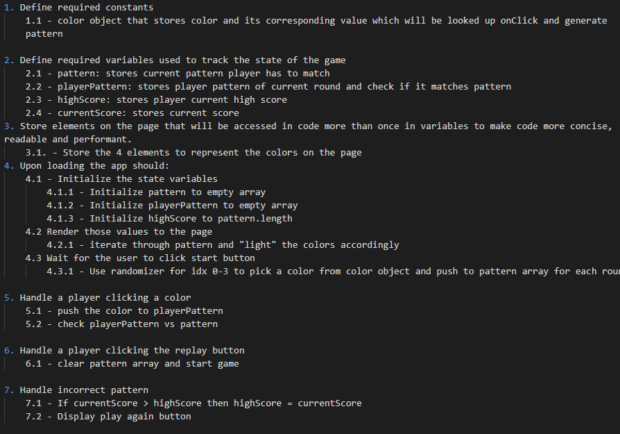

# Simon Says(Summoner Says)
Simon Says is a classic memory game that tests players' ability to recall and replicate sequences of colors, sounds, or actions. The game is typically played with a series of colored buttons that light up or produce sounds in a specific sequence. Players must then replicate the sequence by pressing the buttons in the same order. The sequences become progressively longer and more complex as the game advances, challenging players to remember and reproduce longer patterns accurately. This version of Simon Says is Leage of Legends theme.

# Screenshot

# Technologies Used

- JavaScript
- HTML
- CSS

# Getting Started

Wireframe:

[Click to Play Simon Says!](https://jsonnguyen.github.io/Simon-Says/)

# Next Steps

- Make themes changeable
- Generate random pattern everytime